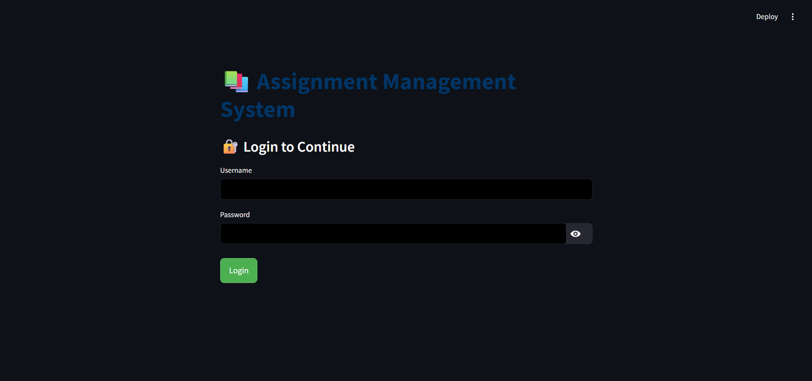
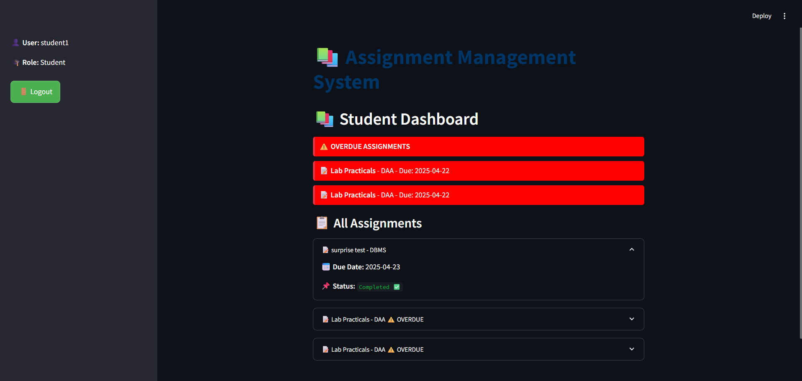
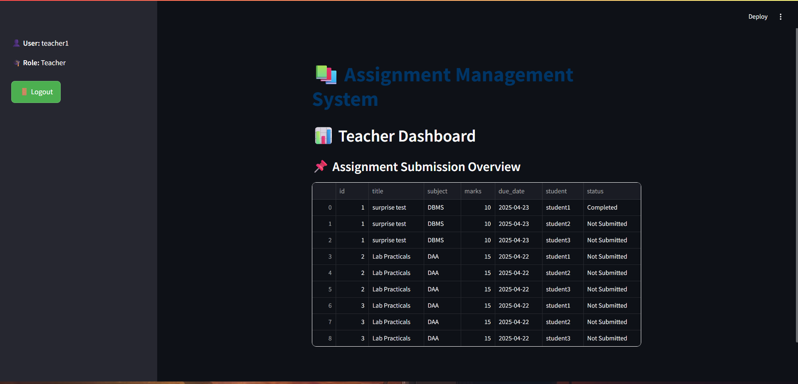

# 📚 Assignment Management System

A full-featured **Assignment Management System** built using **Streamlit** and **SQLite**, allowing teachers, coordinators, and students to interact with academic assignment data.

---

## 🚀 Features

- 🔐 Role-based Login System
- 📊 Teacher Dashboard – View assignment submissions
- 🗂️ Coordinator Dashboard – Add assignments
- 🧑‍🎓 Student Dashboard – View, track, and submit assignments
- 🎨 Custom CSS styling with due/overdue highlights
- 💾 Local SQLite database (no external server required)

---

## 🖼️ Screenshots

### 🔐 Login Page


### 🧑‍🎓 Student Dashboard


### 👨‍🏫 Teacher Dashboard


---

## 💻 How to Run the App

### 1. Clone the Repository

```bash
git clone https://github.com/your-username/assignment-management-system.git
cd assignment-management-system
